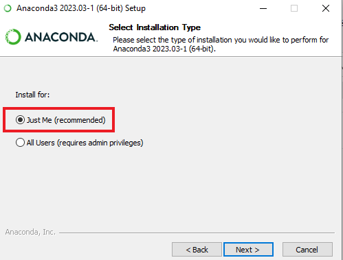

# Indentation 2023 : Post Traitement des essais d'indentation

## Remarques introductives

* Ce tutoriel est pensé pour durer 2h.
* Tous les outils qu'il utilise sont libres et donc gratuits. 
Le mieux est donc de les installer sur votre machine pour vous les approprier.
* Ce dépôt contiendra tous les fichiers que nous produirons pendant la formation.

## Contexte

Dans ce tutoriel, nous allons utiliser la librairie Indentoolbox qui a été développée suite à nos discussions à Indentation2021 à Lorient.
Pour commencer, vous invite à regarder le [dépôt de la librairie](https://gitlab.com/indpp/indentoolbox) et [sa documentation](https://indentoolbox.readthedocs.io/en/latest/).
Cette libraire est développée pour la communauté et, à terme, elle sera développée par la communauté.
Elle doit donc répondre à vos besoins et vous devez faire savoir si ce n'est pas le cas.

## Instructions

Vous aurez plusieurs possibilités pour travailler pendant la formation:

* Sur votre machine personnelle (préférable): si vous choisissez cette option, vous devez installer certains logiciels avant la formation:
    * Anaconda: https://www.anaconda.com/
        * Attention: sous Windows, il faudra installer pour votre utilisateur et ajouter Anaconda à votre "PATH" comme montré ci-dessous:
        
        
        
        * Sous Linux: miniconda suffira ou tout autre gestionnaire d'environnements virtuels Python.

    * Un client Git:
        * Sous Windows: https://git-scm.com/
        * Sous Linux: vous l'avez de base normalement, à vérifier.
    * Vscode: https://code.visualstudio.com/
    * Suivre les instructions d'installation du module IndenToolbox "Standard user" ici: https://gitlab.com/indpp/indentoolbox#for-standard-users
* Sur une machine de la salle informatique ou aura lieu la formation: cette solution est moins préférable mais sera disponible si vous n'arrivez pas ou ne pouvez pas installer les logiciels sur votre machine.

## Données

Des datasets d'essais d'indentation sont disponibles à [ce lien](https://drive.google.com/drive/folders/169cgLeRt96IWq4aN9yQJpiF7VQ2WXWEB?usp=sharing).
Vous avez aussi produit des données d'indentation lors de la session expérimentale, vous pouvez les utiliser si vous disposez d'un export en format `txt`.

## But du tutoriel

* [ ] Découverte de l'outil `IndentoolBox`.
* [ ] Installation et configuration (suivre les instructions de la documentation).
* [ ] Choix de données à traiter.
* [ ] Création d'un notebook avec Jupyter Lab.
* [ ] Pre-traitement basique de vos données.
* [ ] Post-traitement de celles-ci.
* [ ] Discussion sur la suite et la manière de procéder pour faire vivre/évoluer l'outil.

